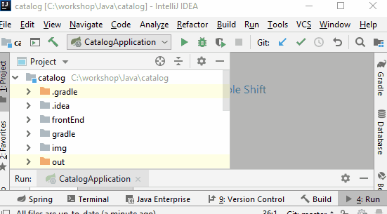
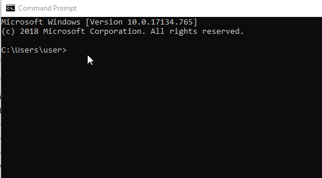
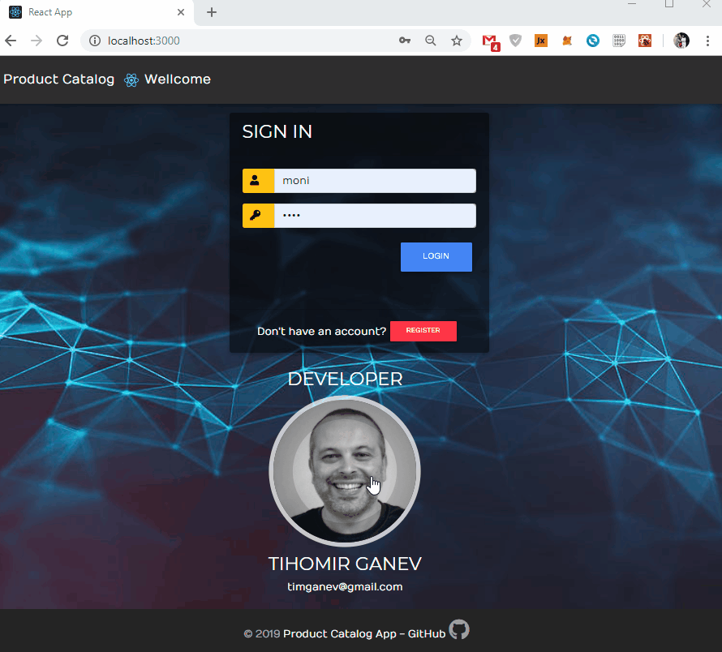
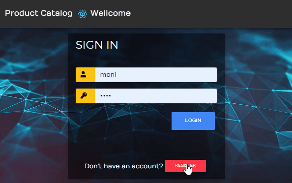
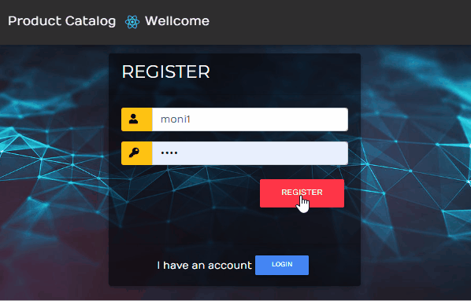
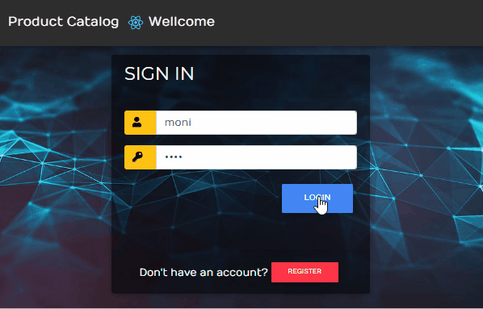
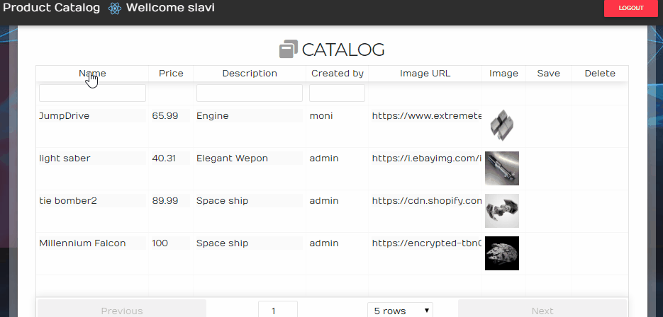
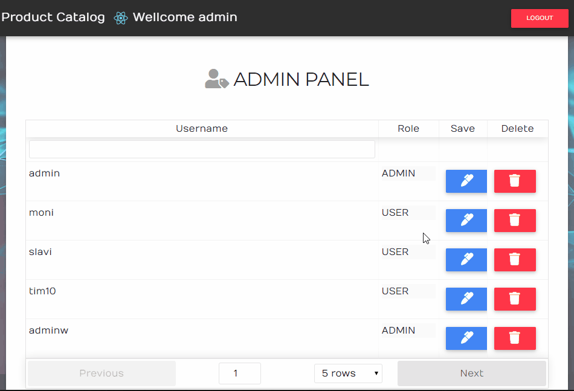

# Product Catalog

## Getting Started
To test or just see what I did follow few easy steps:

- install NODE: https://nodejs.org/en/
- clone the repository
- run the Java back end (you can test it on port 5000):

- cd to the directory with the React front end ` /frontEnd/ReactCatalog`
- run `yarn install` (or `npm install` if you don't use yarn):

- run the front end app using `yarn start` (or `npm start`)
- expected output in terminal `Compiled successfully!` (and should auto open browser to port 3000)
- when the application starts there are 2 external links - to my CV and to this repository:

## Login / Register

- You can swich between login and register form with one click :

- If you try to login with wrong password or username you will get an error massage:

- If you try to register existing user you will get an error massage:

- On a successful login the registration/login form disappears, the nav bar change with personal greeting and logout:

## Login as USER

- If you login as a regular USER the "save/edit" and "delete" options are disabled as well as "new product" button:

- Regular USER can see the product list with "sort" and "filter" functionality:

## Login as ADMIN

- If you login as an ADMIN user, you can see the CATALOG as well as ADMIN PANEL with CRUD functionality:

- ADMIN user can create, edit and delete products: 

- ADMIN user as well can delete users in the ADMIN PANEL or change their privileges:

